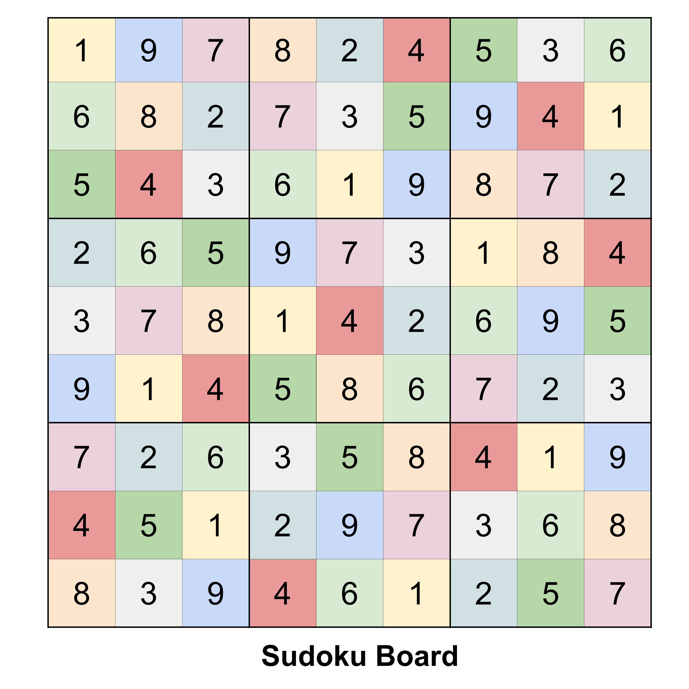
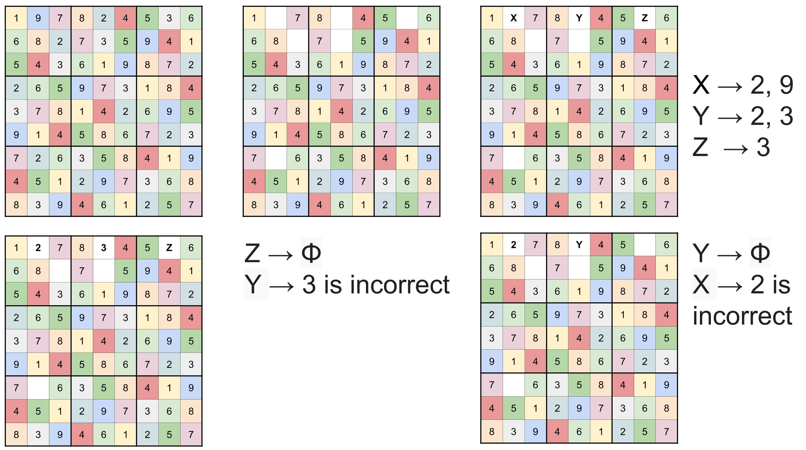
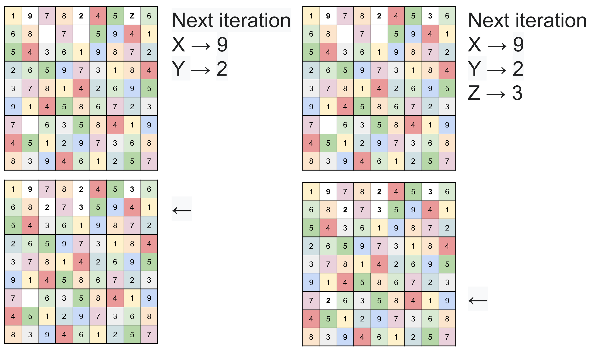

# Sudoku Solver
### Introduction

- Sudoku Board is a logic - based, number placement puzzle
- Each row, column and 3x3 sub-grid should have a unique combination of 1-9 digits
- There should be no repetition in any row, column or sub-grid

### Motivation
- In advanced algorithms class introduced the concept of recursion and backtracking based algorithms
- Submitted a Sudoku Solver as a class project for the advanced algorithms class
- Which generated a random Sudoku Board, removed a set number of elements from the board and returned a solved Sudoku Board

### Backtracking based algorithm
- Algorithmic-technique for solving problems recursively by trying to build a solution incrementally, one piece at a time
- Removing those solutions that fail to satisfy the constraints of the problem at any point of time
- In Sudoku solving puzzle, we try filling digits one by one. Whenever we find that current digit cannot lead to a solution, we remove it (backtrack) and try next digit

### Backtracking by example

### Generating a Sudoku Board

### Approach
### Generating a playable board
#### Method 1:
- Randomly, delete k elements from the Sudoku Grid
- Advantage:
  - Quick implementation,
  - Generate k pairs of indices on the board,
  - Assign values to null
- Disadvantage:
  - The uniqueness of the solution may be lost
  - Multiple solved boards may be possible after k removals

#### Method 2
- Keep a counter of numberOfMultipleSoln, initialized to 0
- Select a random index on the board, 
- Remove the element from the grid at the index
- Solve the board, check the total number of solutions that are present,
- If the total number of solutions is 1, remove the element
- Else, reinstate the element at the index and increment numberOfMultipleSoln
- numberOfMultipleSoln, can be explored further for determining the level of difficulty of the board
- And instead of checking for number of elements to be removed, k this parameter is set to find a board for which a unique board exists

### Building a responsive UI
- The app is based on React where the board, new game button and number buttons are divided into components
- The board is collection of divs, where each item is a Block, and a row is an array of divs
- CSS in the app is added with Styled Components

### Components
### Redux store
### Reducers - Action Types
### React Hooks with Mousetrap
